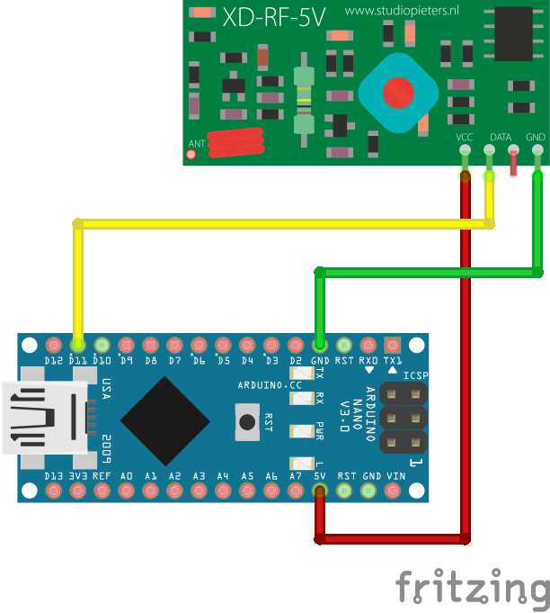

# Smart Home Server 

Receive and store data from several sensors sent via 433MHz transmitters and
is able to talk to a light control HoT-Unit (Home of Things).  
This application is the backend and talks to a frontend app via WebSockets.

## Installation

1. Deploy to / checkout on the production system
1. Run ``npm install --only=prod``
1. Optional: Install screen via ``sudo apt-get install screen``
1. Open named screen session ``screen -S server``
1. Run ``npm run start`` on the production system
1. Leave session with ``strg+a d`` and reattach with ``screen -r server``

## Development

```bash
npm install
npm run dev
```

### Receive data

There should be an arduino connected to a serial port that has a 433.92MHz receiver attached to it. See [docs/receiver.ino](docs/receiver.ino).

You propably need to adjust the serial port id in line 1 of [app/index.js](app/index.js).



